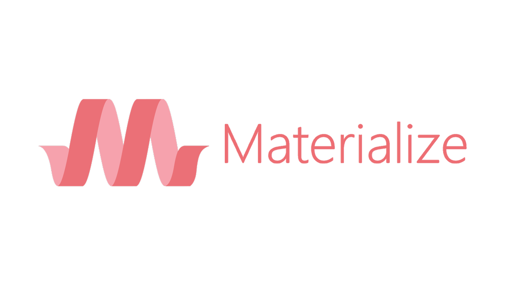

# Material Design - Materialize CSS

*December 2020 / January 2021*

> 🔨  From Udemy [Materialize CSS - Apprendre à créer des sites en Material Design](https://www.udemy.com/course/materialize-css/).

* * *

Materialize is a UI component library created with CSS, JavaScript, and HTML.

Materialize UI components help in constructing attractive, consistent, and functional web pages and web apps, while adhering to modern web design principles such as browser portability, device independence, and graceful degradation.

It helps in creating faster, beautiful, and responsive websites.

It is inspired from Google Material Design.

<h1 align="center">
    
</h1>

## Demos

[Overview: CSS](https://raigyo.github.io/material-design-materialize-/overview/01-css/01-typography.html)

[Overview: Components](https://raigyo.github.io/material-design-materialize-/overview/02-components/01-buttons.html)

[Overview: Javascript](https://raigyo.github.io/material-design-materialize-/overview/03-javascript/01-carousel.html)

[Overview: Forms](https://raigyo.github.io/material-design-materialize-/overview/04-forms/01-autocomplete.html)

## [Subjects covered](./overview)

### [CSS](./overview/01-css)

- Typography
- Colors
- Grids
- Alignment
- Medias
- Effects
- Tables

### [Components](./overview/02-components)

- Buttons
- Icons
- FloatingBtn
- Cards
- Collections
- Navbars
- Preloader
- Footer

### [Javascript](./overview/03-javascript)

- Carousel
- Accordion
- DropDown
- Discovery
- Modales
- Parallax
- ScrollSpy
- Toast&ToolTips
- Waves

### [Forms](./overview/04-forms)

- Auto Complete
- Range, boxes, radio
- Select, switches
- Inputs

## Useful links

- [Material Design](https://material.io/design)
- [Materialize CSS](https://materializecss.com/)
- [Ziratsu/BAS-1-CSS-MATERIALIZE](https://github.com/Ziratsu/BAS-1-CSS-MATERIALIZE)
- [Ziratsu/BAS-2-COMPOSANTS-MATERIALIZE](https://github.com/Ziratsu/BAS-2-COMPOSANTS-MATERIALIZE)
- [Ziratsu/BAS-3-JAVASCRIPT-MATERIALIZE](https://github.com/Ziratsu/BAS-3-JAVASCRIPT-MATERIALIZE)
- [Ziratsu/BAS-4-Formulaires-MATERIALIZE](https://github.com/Ziratsu/BAS-4-Formulaires-MATERIALIZE)
- [Ziratsu/SiteMaterializeForm](https://github.com/Ziratsu/SiteMaterializeForm)
- [Unsplash Source](https://source.unsplash.com/)
- 